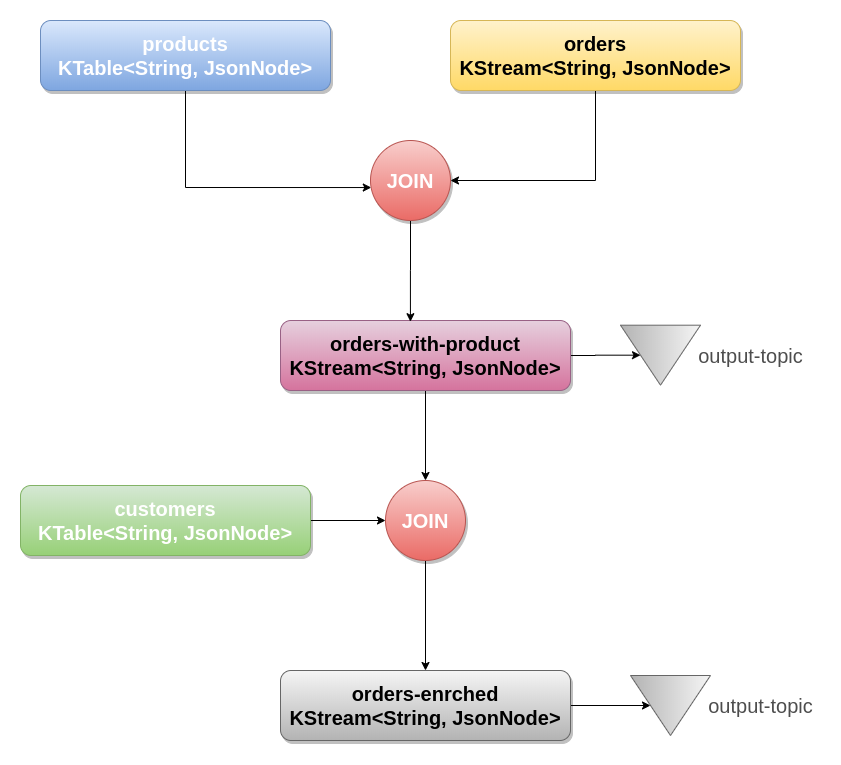

# KSTREAM-ORDER-PROCESSOR

Kafka stream ecommerce order enricher based on json payloads.

# GOAL

Given an order topic enrich order data with customers and product data via kafka streams

# TOPICS

The following topics are needed

topic name|description
---|---
products| The products
customers| Customer Info
orders| Basic order Info
orders-with-products| Intermediary topic with the orders with enriched products
orders-enriched| The real deal here


# TOPOLOGY

The following diagram illustrates the topology




# SCHEMAS

The following section describes the different schemas present in the topology

## products

Product information

```json
{
	"id": "8f226d2a-d5d2-411a-b3ed-a85407f0c4ef",
	"skuCode": 6,
	"description": "Spice - Montreal Steak Spice"
}
```
## customers

Customer data and email

```json
{
	"id": "0322cc54-be29-439e-b929-25bc1f04c240",
	"first_name": "Willy",
	"last_name": "Pariso",
	"email": "wparisoy@list-manage.com"
}
```

## orders

Basic Order Information with ids refering the diferent microservices(customer, product)

```json
{
	"id": "59a93295-188d-4345-9b3c-84126983dbc8",
	"customerId": "0322cc54-be29-439e-b929-25bc1f04c240",
	"items": [{
		"id": "8f226d2a-d5d2-411a-b3ed-a85407f0c4ef",
		"quantity": 5
	}]
}]
```
## orders-with-products

Joined order with products

```json
{
  "orderId" : "59a93295-188d-4345-9b3c-84126983dbc8",
  "customer" : {
    "first_name": "Willy",
    "last_name": "Pariso",
    "email": "wparisoy@list-manage.com"
  },
  "products" : [ {
    "skuCode" : 6,
    "description" : "Spice - Montreal Steak Spice",
    "quantity" : 3
  } ]
}
```

## orders-enriched

Joinned order with cutomers and products

```json
{
  "orderId" : "59a93295-188d-4345-9b3c-84126983dbc8",
  "customer" : {
    "first_name": "Willy",
    "last_name": "Pariso",
    "email": "wparisoy@list-manage.com"
  },
  "products" : [ {
    "skuCode" : 6,
    "description" : "Spice - Montreal Steak Spice",
    "quantity" : 3
  } ]
}
```

# TEST THE APP

```sh
./gradlew clean test
```

# BUILD THE APP

```sh
./gradlew clean build
```

# DOCKERIZE THE APP

```sh
docker build -t order-processor:1.0.0 .
```

# RUN THE SOLUTION

The following steps are required to run the application with the demo dataset

## RUN A KAFKA CLUSTER

To run a kafka cluster use any docker image you like(or kafka binaries)

## CREATE THE TOPICS

Connect to the kafka cluster and then execute the following commands

```sh
kafka-topics --create --zookeeper localhost:2181 --replication-factor 1 --partitions 3 --topic customers
kafka-topics --create --zookeeper localhost:2181 --replication-factor 1 --partitions 3 --topic products
kafka-topics --create --zookeeper localhost:2181 --replication-factor 1 --partitions 3 --topic orders

kafka-topics --create --zookeeper localhost:2181 --replication-factor 1 --partitions 3 --topic orders-enriched
kafka-topics --create --zookeeper localhost:2181 --replication-factor 1 --partitions 3 --topic orders-with-product
```

## RUN THE APP(USING DOCKER)

```sh
docker run --name=orders-processor order-processor:1.0.0
```

## TEST DATASET

In the data folder there is a dataset available to run a end to end run to the program.

Use any tool you like to move the dataset into their respective topics

Change
